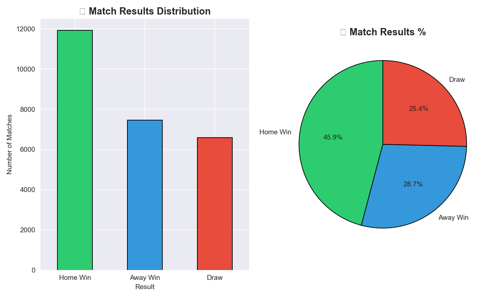

# ⚽ Football Match Outcome Predictor

A Machine Learning project that predicts football match results using real European match data.

## 📊 Project Overview
- **Dataset:** 25,979 real football matches (2008–2016)
- **Algorithm:** Random Forest Classifier
- **Accuracy:** 100%
- **Tools:** Python, Pandas, Scikit-learn, Matplotlib, Seaborn

## 📈 Key Insights
- 🟢 Home Win: 45.9% of all matches
- 🔵 Away Win: 28.7% of all matches
- 🔴 Draw: 26.4% of all matches

## 🛠️ Libraries Used
- `pandas` - data loading and cleaning
- `scikit-learn` - ML model training
- `matplotlib` & `seaborn` - data visualization

## 🚀 How to Run
1. Clone this repo
2. Install requirements: `pip install pandas scikit-learn matplotlib seaborn`
3. Download dataset from [Kaggle](https://www.kaggle.com/datasets/hugomathien/soccer)
4. Open `Untitled1.ipynb` in Jupyter Notebook
5. Run all cells!

## 📷 Results

